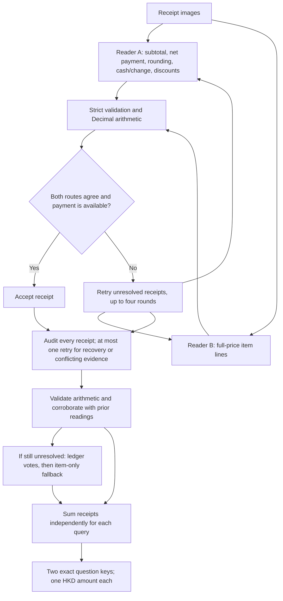

# FTEC5660 Homework 1: Receipt Chain

Build a LangChain pipeline that reads every supermarket receipt in a folder
with the vision-capable DeepSeek Flash model and answers these two questions:

1. How much money did I spend in total for these bills?
2. How much would I have had to pay without the discount?

For this homework, **amount spent** means the final payment after the receipt's
rounding line. **Without the discount** means the sum of the original positive
item prices: add back every promotion, coupon, member, app, packaging-damage,
and percentage discount, but do not add back rounding.

## Student task

Only edit the two functions in `hw1.py` that contain `### YOUR CODE HERE`:

- `build_chain()` creates your LangChain chain.
- `answer_queries()` runs the chain on the receipt images and returns one final
  response for each question.

You may use prompt chaining, routing, parallel calls, reflection, or a
combination. Your final responses should each contain one HKD amount. Do not
hard-code filenames or public answers; grading uses unseen receipt folders.

## Setup and public test

```bash
python3 -m venv .venv
source .venv/bin/activate
pip install -r requirements.txt
```

Put your DeepSeek key after `DEEPSEEK_API_KEY=` in `.env`, then run:

```bash
python3 hw1.py --image-folder public_test
```

The program creates `results.csv` in the current directory. Its columns are
`query`, `model_response`, and `correctness`. The public answers are in
`public_test/ground_truth.json`. The starter intentionally returns the dummy
response `please design your chain to answer these two queries.` so it runs
before you add any API code.

The required model is `deepseek-v4-flash-vision-exp`, the vision-capable
DeepSeek Flash model. JPEG, PNG, GIF, and WebP inputs are accepted by the
homework runner.

## Homework 1 solution

### Chain design



### Description

The implementation uses `deepseek-v4-flash-vision-exp` with two primary LangChain pipelines
(`ChatPromptTemplate → ChatDeepSeek → JsonOutputParser`). Reader A transcribes
the receipt totals and discounts; Reader B independently transcribes the original
item-line amounts. Python uses `Decimal` for all arithmetic. Query 1 uses the net
payment after rounding, distinguishing cash tendered from cash minus change.
When available, payment readings from a round in which both readers agree take
priority over earlier unresolved readings; this is a consistency heuristic,
not independent verification of the payment itself.
Query 2 adds each discount back to SUBTOTAL, excluding rounding, and is checked
against the full-price item sum. Missing totals are reconstructed only when the
printed rounding or cash/change fields justify it. Malformed amounts, booleans,
non-finite numbers and incomplete discount lists are rejected. Unresolved receipts
are read for up to four primary rounds in total, followed by a final evidence
review using a separate prompt with the same required model. Failed or incomplete
reviews get at most one additional recovery attempt. The review reads
the printed totals, discounts and, when readable, item lines without seeing earlier
candidate answers. Python checks arithmetic consistency; a review amount must
agree with its own item sum or an earlier amount, unless no earlier amount exists.
A third conflicting guess is rejected unless internally corroborated. Every
receipt is audited, including initially reconciled receipts. Overriding an
existing agreement requires two audit readings with the same payment and
without-discount total, each internally corroborated by its item sum. Audit
and selected per-receipt amounts are logged to help diagnose errors.
If review still cannot settle a disagreement, ledger votes take priority
because SUBTOTAL plus discounts is the assignment's definition; repeated item
readings alone cannot overrule a usable ledger. Item-only recovery is retained
when ledger information is unavailable, with a warning. These are heuristics,
not proof of correct OCR. The stages run sequentially, with up to eight concurrent
requests per stage.
Requests have a 90-second timeout and the overall reading budget is the larger
of 180 seconds and 90 seconds per image. Within that budget, the final review
reserves 180 seconds per group of eight images, capped at half of the budget.
Daemon workers bound waiting on stuck requests; the final review does not extend
the overall deadline. Exhausted failures produce warnings and a numeric partial total;
they cannot guarantee a correct answer if a receipt cannot be read.

All implementation changes in `hw1.py` are inside `build_chain()` and
`answer_queries()`; the remaining template text is unchanged. Neither chain
reads ground truth or hard-codes public receipt answers.

### Testing

```bash
python -m unittest discover -s tests -v
python hw1.py --image-folder public_test
cat results.csv
```

The offline tests cover the PDF example, each public receipt's arithmetic,
cash/change, positive and negative rounding, multiple discounts, zero amounts,
currency prefixes, missing fields, malformed values, transport failures,
duplicate receipts, exhausted retries, the deadline, empty inputs, unreadable
files and CSV generation. They use simulated model responses, so they test
program logic rather than vision accuracy. Public-set API results are recorded
separately in `TEST_RESULTS.md`.

## Homework 1 Task 2

The reflection is in [HW1_Task2_Reflection.md](HW1_Task2_Reflection.md).
